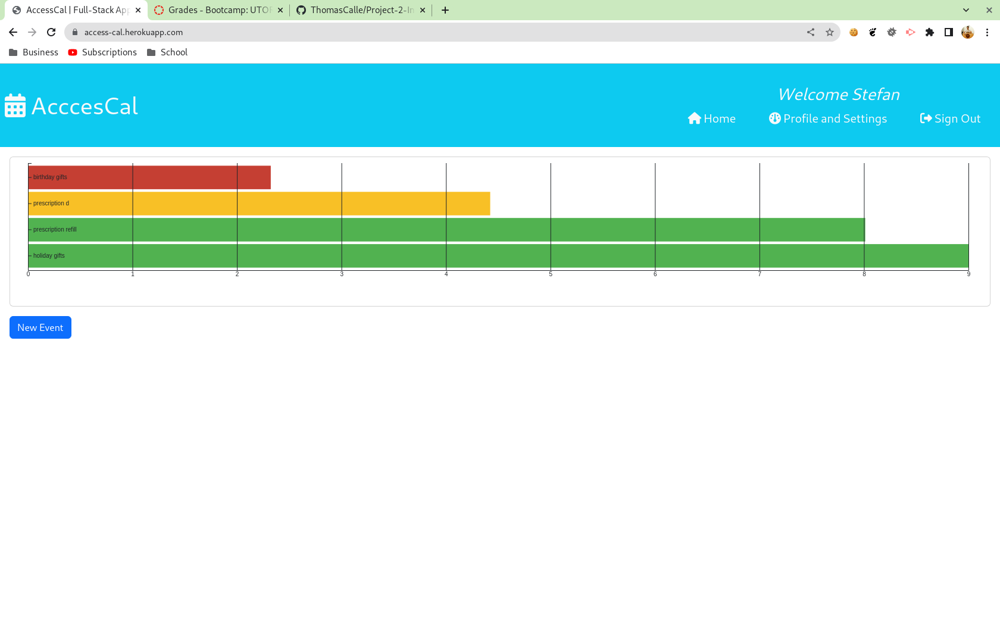

# Project-02-Interactive-Full-Stack-Application

[](https://opensource.org/licenses/MIT)
  
## Description:
Welcome to AccessCal our Interactive Full-Stack Application developed for those with Attention-Deficit/Hyperactivity Disorder(ADHD). The application provides a comprehensive suite of tools tailored to those with time-blindness to visualise their calendar and how each event tracks to the deadline. The user can create various event and associate various various thresholds (i.e. reminders) that will help them visualise the criticality of each event. 


The application is device-friedly allowing the user to intergrate a visual event tracker tailored their personal devices in order to meet the subjects needs. 

AccessCal offers a streamlined and intuitive user interface, allowing users to effectively manage their own visual event tracker. 

## Table of Contents:
- [Overview](#Overview)
- [The Challenge](#The-Challenge)
- [Usage Information](#Usage-Information)
- [Installation Process](#Installation-Process)
- [Built With](#Built-With)
- [What I Learned](#What-I-Learned)
- [Continued Development](#Continued-Development)
- [License](#License)
- [Author](#Author)
- [Acknowledgments](#Acknowledgments)

# Overview

## The Challenge:

As a user (with time blindness/ADHD)
I would like to see a visualization of my upcoming events
WHEN I log in to the page,
THEN I see my most pressing events graphically displayed, coloured based on the urgency of the event, and a list of my other, upcoming events
WHEN I create an event
THEN I am given the ability to set a category to define alert threshold periods
WHEN I click on the event
THEN I am given a calendar and the ability to add task events related to the event.


## Usage Instructions
1. Open the application
2. Log in or create an account
3. Enter new events in your calendar
4. View events along the bar graphs
    1. click on the bar graph to show info about the event
    

## Solution URL:
[Solution URL Link:](http://access-cal.herokuapp.com/)

## YouTube Walkthrough Video:
no video walkthrough required

## Screenshots:
### Figure 1. The calendar visual



### Figure .2 The event visual


## Installation Process
1. Clone the Repository from GitHub 
2. (or) Download Zip Folder from Repository from GitHub 


## Continued Development:
1. Establishing a Profile and Settings page where the user can enter their preferences
2.  
3.  

## License & Copyright ©
  
[](https://opensource.org/licenses/MIT) [Open Source Initiative Link](https://opensource.org/licenses/MIT)

### Copyright © 2023
```md
Permission is hereby granted, free of charge, to any person obtaining a copy
of this software and associated documentation files (the "Software"), to deal
in the Software without restriction, including without limitation the rights
to use, copy, modify, merge, publish, distribute, sublicense, and/or sell
copies of the Software, and to permit persons to whom the Software is
furnished to do so, subject to the following conditions:

The above copyright notice and this permission notice shall be included in all
copies or substantial portions of the Software.

THE SOFTWARE IS PROVIDED "AS IS", WITHOUT WARRANTY OF ANY KIND, EXPRESS OR
IMPLIED, INCLUDING BUT NOT LIMITED TO THE WARRANTIES OF MERCHANTABILITY,
FITNESS FOR A PARTICULAR PURPOSE AND NONINFRINGEMENT. IN NO EVENT SHALL THE
AUTHORS OR COPYRIGHT HOLDERS BE LIABLE FOR ANY CLAIM, DAMAGES OR OTHER
LIABILITY, WHETHER IN AN ACTION OF CONTRACT, TORT OR OTHERWISE, ARISING FROM,
OUT OF OR IN CONNECTION WITH THE SOFTWARE OR THE USE OR OTHER DEALINGS IN THE
SOFTWARE.
```

## Author
Follow our team on Github! Additional questions or concerns? Feel free to contact us!
- [ThomasCalle](https://github.com/ThomasCalle)
- [Stephen Cardie](https://github.com/omgthegreenranger)
- [Stefan Marinov](https://github.com/scorpionfiko)

See you soon!

© 2023 [ThomasCalle](https://github.com/ThomasCalle), [Stephen Cardie](https://github.com/omgthegreenranger), [Stefan Marinov](https://github.com/scorpionfiko). Confidential and Proprietary. All Rights Reserved.